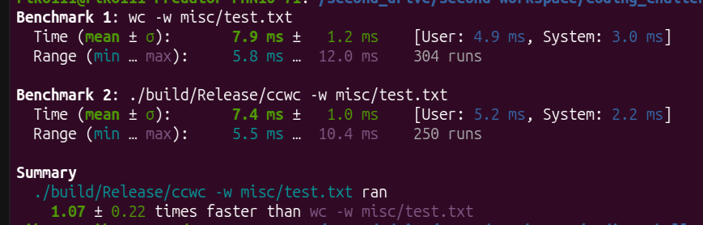

# CCWC - a faster alternative to UNIX wc

## What is ccwc?

ccwc is a faster alternative to UNIX wc command. The measurements were done using hyperfine command and they are as follows:



How to build:

``` shell
    cmake --preset conan-release
    cmake --build --preset conan-release
```

After that, the binary should appear in the build/Release/ directory.
From this location, it can be moved to /usr/bin/ and after that, it can be used as follows:

```
Usage ccwc [options] [file...]
    Options:
    -h, --help          Show help message
    -w, --words         Count words
    -l, --lines         Count lines
    -c, --characters    Count characters
    -b, --bytes         Count bytes
```